<h1 align="center"> 🍕 Telegram Pizzeria Bot 🍕 </h1>

</br>
<p align="center">
  
  
  </br>
  
  
  </br>
  
  </br>
</p>

<h1 align="left"> 📋 About</h1> 

</br>

This bot was created to simplify the process of ordering pizza directly through Telegram. With an intuitive interface, users can effortlessly browse the menu, place orders, and make payments — all within a single chat. The bot ensures a smooth, secure, and efficient experience for both customers and administrators.

For enhanced management, the bot features an advanced admin panel accessible via Telegram and Django Admin, providing a user-friendly interface for handling orders, products, categories, and more.

PostgreSQL is used as a reliable database for securely storing user data, orders, and catalog information, ensuring data integrity and performance.

Additionally, Docker is implemented for easy deployment and scalability, allowing the bot to run seamlessly across different environments.

## Stack:

 - **Backend**: [**`Python 3.12+`**](https://python.org/)
 - **Framework**: [**`Aiogram 3.0+`**](https://docs.aiogram.dev/)
 - **Database**: [**`PostgreSQL`**](https://postgresql.org/)
 - **Admin Panel**: [**`Django`**](https://djangoproject.com/)
 - **Deployment**: [**`Docker`**](https://docker.com/)

### 📱 Main Menu
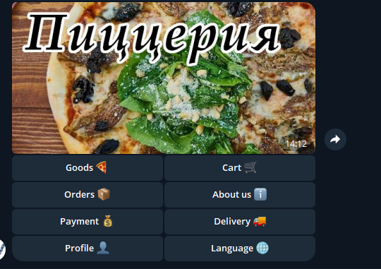

### 🛒 Catalog & Ordering  
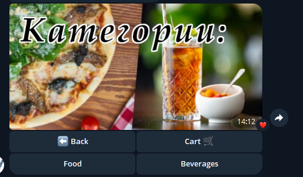
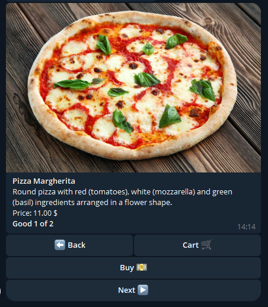
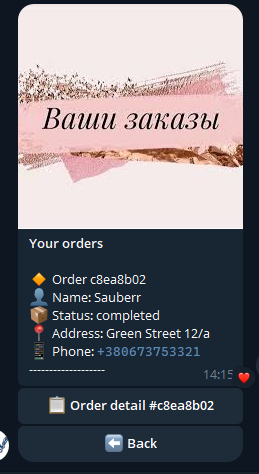
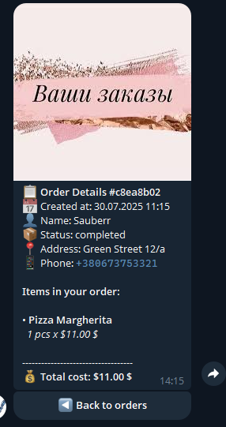

### 👨‍💼 Admin Panel via Telegram or Django
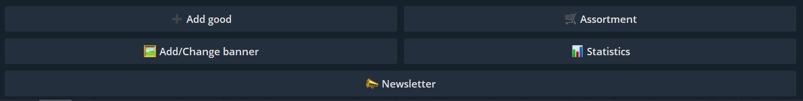
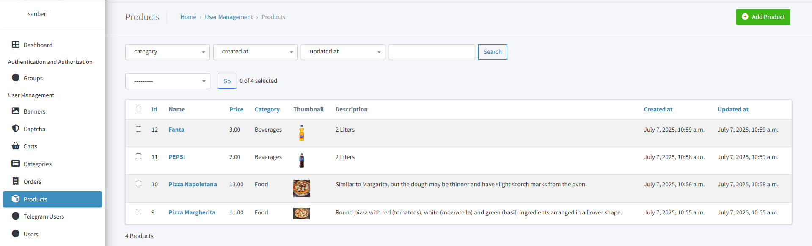

### 🔒 Captcha Protection
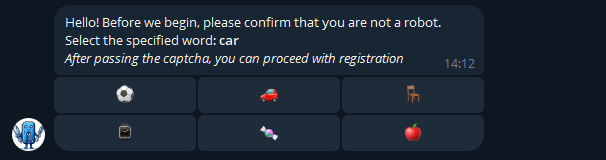

### 👤 User Profile
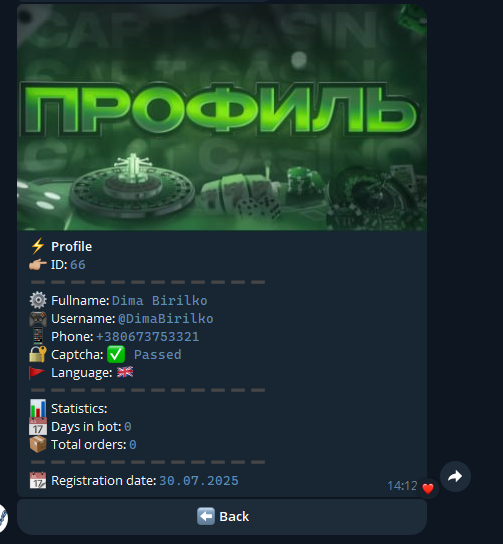

### 💳 Payment System
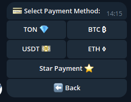

### 🛒 Cart
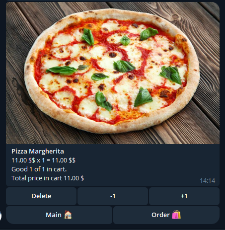

## 🚀 Features

### 👨‍💼 For Administrators
* Advanced admin panel accessible via Telegram and Django Admin
* CRUD operations for managing products, categories, and banners
* **Promo code management** — create, edit, delete and toggle codes directly in the bot
* Sales and activity statistics with detailed analytics
* User management and order monitoring
* Sending notifications and messages to users
* Order status management and processing
* Product inventory control

### 👤 For Users
* Intuitive catalog browsing with navigation and pagination
* Payment via Telegram Pay and cryptocurrency payments
* **Promo code support** — enter a code at checkout to get a percentage discount; the bot validates it and shows the original price, discount amount, and new total before payment
* Easy order placement and order history viewing
* User profile with personal information and preferences
* Shopping cart functionality with quantity management
* Real-time order tracking and notifications
* Captcha protection for security
* Localization support for multiple languages
* Subscription verification before bot usage

## 🛠️ Local Development

**Requirements:** Python 3.12+, PostgreSQL, Redis

1. **Clone the repository:**
   ```bash
   git clone https://github.com/your-username/telegram-pizzeria-bot.git
   cd telegram-pizzeria-bot
   ```

2. **Create and activate virtual environment:**
   ```bash
   python3.12 -m venv .venv
   source .venv/bin/activate
   ```

3. **Install dependencies:**
   ```bash
   pip install --upgrade pip
   pip install -r requirements.txt
   ```

4. **Configure environment variables:**
   ```bash
   cp example.env .env
   ```

   Open `.env` and fill in the required values. Key variables:

   ```env
   TOKEN=your_telegram_bot_token
   ADMIN_LIST=your_telegram_id

   POSTGRES_NAME=telegrambot
   POSTGRES_USER=postgres
   POSTGRES_PASSWORD=postgres
   POSTGRES_HOST=localhost
   POSTGRES_PORT=5432

   # Redis — for local run use localhost
   REDIS_URL=redis://localhost:6379/0

   CRYPTO_TOKEN=your_crypto_token
   STAR_PAYMENT_TOKEN=your_star_token

   DJANGO_SECRET_KEY=your-long-random-secret-key
   DJANGO_SUPERUSER_USERNAME=admin
   DJANGO_SUPERUSER_EMAIL=admin@example.com
   DJANGO_SUPERUSER_PASSWORD=strongpassword
   ```

   **Where to get tokens:**
   - **Telegram Bot Token** — [@BotFather](https://t.me/botfather)
   - **Crypto Token** — [CryptoPay](https://t.me/CryptoBot)

5. **Start Redis locally:**
   ```bash
   # macOS
   brew install redis && brew services start redis

   # Ubuntu
   sudo apt install redis-server && sudo systemctl start redis

   # or via Docker
   docker run -d -p 6379:6379 redis:7-alpine
   ```

6. **Apply migrations:**
   ```bash
   PYTHONPATH=. python django_project/telegrambot/manage.py migrate
   ```

7. **Run the bot:**
   ```bash
   python app.py
   ```

8. **Django Admin** (optional, in a separate terminal):
   ```bash
   PYTHONPATH=. python django_project/telegrambot/manage.py runserver
   # open http://127.0.0.1:8000/admin
   ```

## 🐳 Docker Deployment

### Quick Start
```bash
docker build .
docker-compose up -d
```

### View logs
```bash
docker-compose logs -f
```

### Create superuser via Docker
```bash
docker-compose exec web python src/manage.py createsuperuser
```

## 💻 HotKeys
* **Start** - `/start`
* **Main menu** - `/menu`
* **About** - `/about`
* **User Profile** - `/profile`
* **Payment** - `/payment`
* **Orders** - `/orders`
* **Shipping** - `/shipping`
* **Admin Panel** - `/admin` (admin only)

## 📞 Contact 
To contact the author of the project, write to email dmitriybirilko@gmail.com
